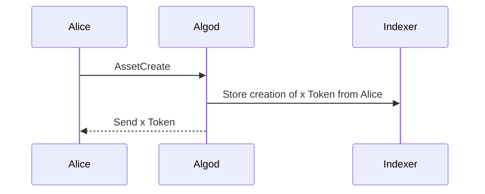
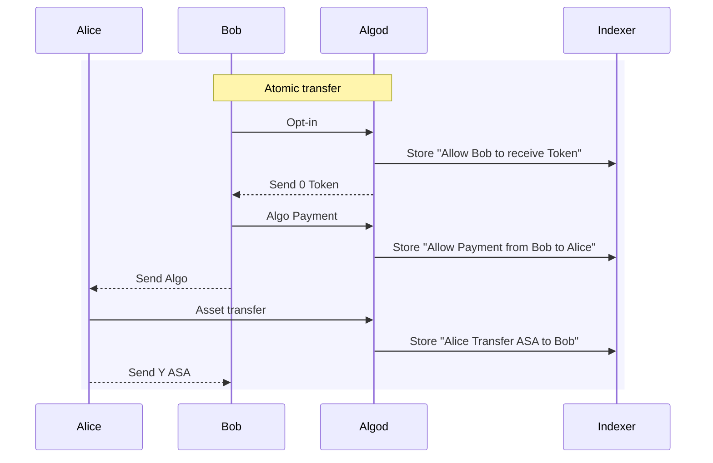
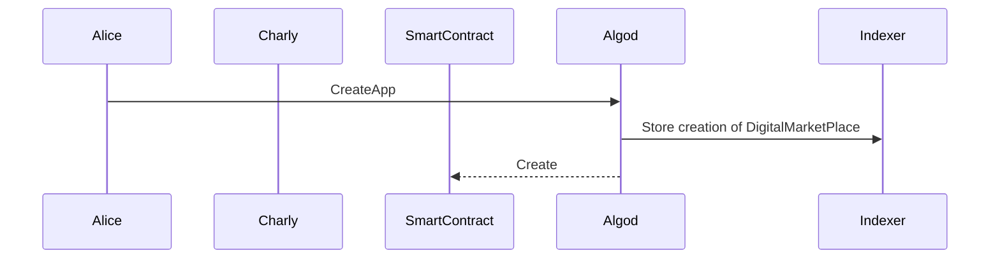
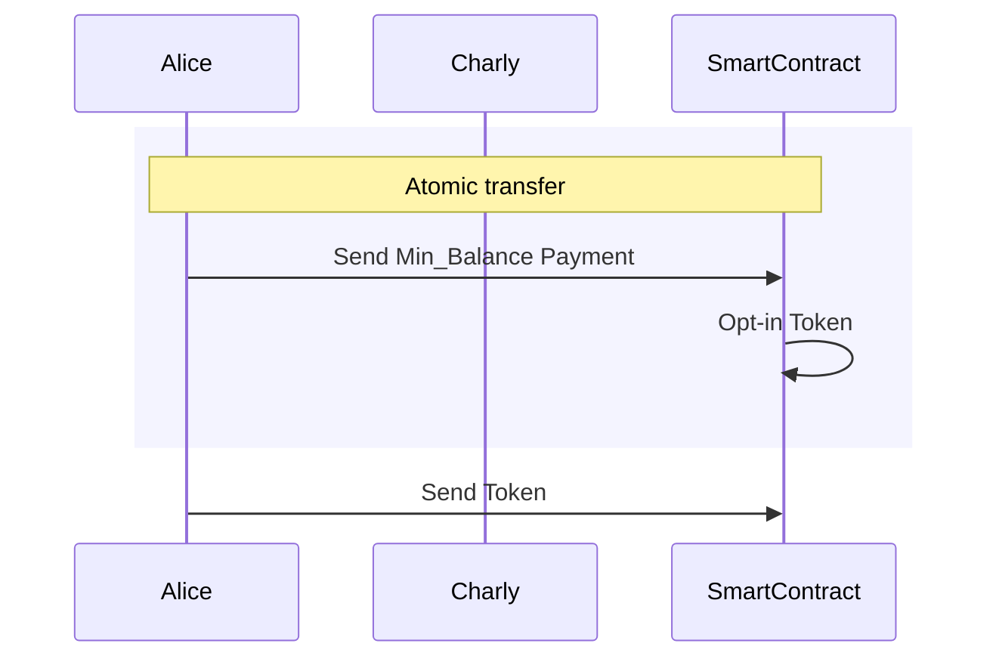
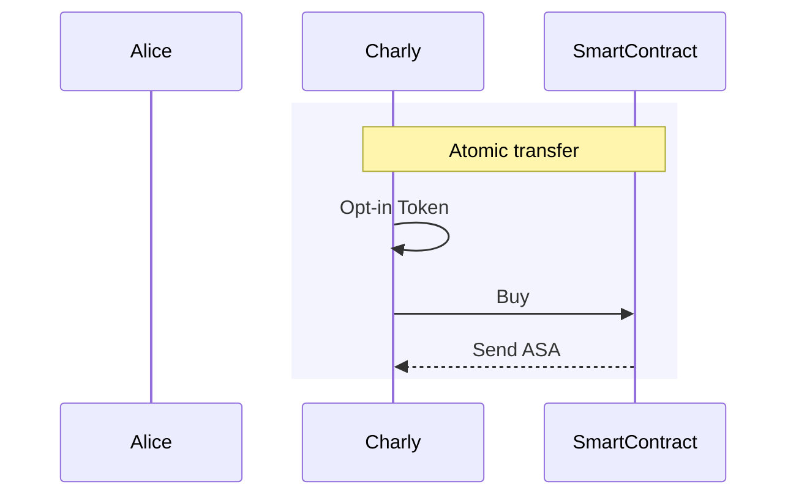
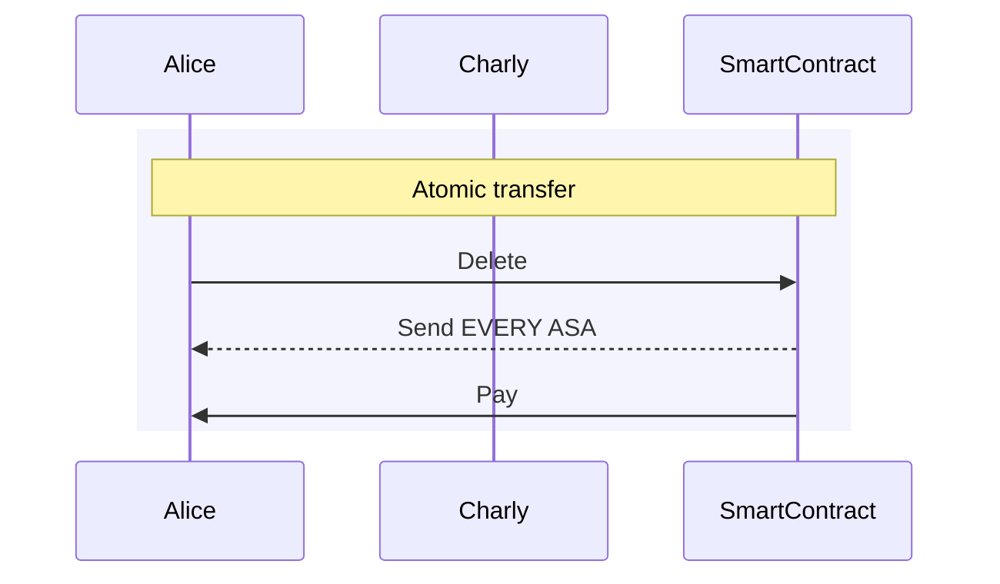

# TP

## Prerequisites

Create a new fork of this project on you Github repository.

## Start the Development Environment

1. Click on the Code button (green button with a dropdown arrow on the top right).
2. Select the Codespaces tab.
3. Click on the Create codespace on main button.
4. Wait for the setup to complete before proceeding to the next step.

> It will prompt you a message to install the "Python extension for Visual Studio Code", I would recommand to accept to avoid some warnings about missing dependencies

### Verify installation

1. `$ algokit doctor` You should have something similar to the following:

```console
timestamp: 2025-01-07T12:12:41+00:00
AlgoKit: 2.5.1
AlgoKit Python: 3.12.1 (main, Dec 12 2024, 22:30:56) [GCC 9.4.0] (location: /usr/local/py-utils/venvs/algokit)
OS: Linux-6.5.0-1025-azure-x86_64-with-glibc2.31
docker: 27.3.1-1
docker compose: 2.31.0
git: 2.47.1
python: 3.12.1 (location: /home/codespace/.python/current/bin/python)
python3: 3.12.1 (location: /home/codespace/.python/current/bin/python3)
pipx: 1.7.1
poetry: Command not found!
  Poetry is required for some Python-based templates;
  install via `algokit project bootstrap` within project directory, or via:
  https://python-poetry.org/docs/#installation
node: 20.18.1
npm: 10.8.2
```

1. `$ gh codespace ports` Port 4001/4002/5173/8980 should be open:

```console
LABEL  PORT   VISIBILITY  
       4001   public      
       4002   public      
       5173   public      
       5443   private     
       8980   public      
```

## TP 1
Utilisez le fichier `tp_1.py`

## Import

```python
import algokit_utils as au
import algosdk as sdk
from utils import (
    account_creation,
    display_info,
)
```

> display_info(algorand, ["ALICE", "BOB"])
> permet d'afficher les informations des comptes

## Choisir son réseau

[Algorand Client](https://algorandfoundation.github.io/algokit-utils-py/capabilities/algorand-client.html#algorand-client)
> Pour localnet `algorand = au.AlgorandClient.from_environment()`

### Verifier que le réseau est correctement initialisé

```python
    print(algorand.client.algod.block_info(0))
    print(algorand.client.indexer.health())
```

## Création des comptes

```python
    alice = account_creation(algorand, "ALICE", au.AlgoAmount(algo=10_000))
    bob = account_creation(algorand, "BOB", au.AlgoAmount(algo=100))
```

[Account Management](https://algorandfoundation.github.io/algokit-utils-py/capabilities/account.html#account-management).

You can access the mnemonic associated with an account like this:
`sdk.mnemonic.from_private_key(alice.private_key)`

## Création d'un payment d'alice vers Bob de 1 Algo

[PaymentTxn](https://algorandfoundation.github.io/algokit-utils-py/autoapi/algokit_utils/algorand/index.html#algokit_utils.algorand.AlgorandClient.create_transaction)
`pay_txn = algorand.create_transaction.payment(..)`

> PaymentParams is accessible via `au.PaymentParams`
> AlgoAmount is accessible via `au.AlgoAmount`

## Signature de la transaction

[Transaction](https://py-algorand-sdk.readthedocs.io/en/latest/algosdk/transaction.html#algosdk.transaction.Transaction)
`pay_txn_signed = pay_txn.sign(..)`

## Envoi de la transaction

[Create](https://py-algorand-sdk.readthedocs.io/en/latest/algosdk/v2client/algod.html#algosdk.v2client.algod.AlgodClient.send_transactions)
`tx_id = algorand.client.algod.send_transaction(..)`

[Wait for Confirmation](https://py-algorand-sdk.readthedocs.io/en/latest/algosdk/transaction.html#algosdk.transaction.wait_for_confirmation)
`res = sdk.transaction.wait_for_confirmation(..)`

## Afficher le résultat

`print(res)`

## Visualiser sur l'explorer

Ouvrir l'explorer depuis le terminal:
`algokit explore`

## Réaliser l'opération inverse

### Transfer de 1 Algo de Bob vers Alice

[Send](https://algorandfoundation.github.io/algokit-utils-py/autoapi/algokit_utils/algorand/index.html#algokit_utils.algorand.AlgorandClient.send)

`payback_txn = algorand.send.payment(..)`

> tips vous devez utiliser bob.signer

```python
print('Transaction confirmed, round: '
        f'{payback_txn.confirmation["confirmed-round"]}')
```

## TP 2

## Création d'un Token depuis le compte d'Alice

> On Algorand you can create a token without a smart-contract by using [Algorand Standard Asset](https://developer.algorand.org/docs/get-details/asa/)




[asset_create](https://algorandfoundation.github.io/algokit-utils-py/capabilities/testing.html#creating-test-assets)

Vous devez avoir les paramètres suivants:

```python
    total=15
    decimals=0
    default_frozen=False
```

Vous devez trouver l'asset ID de votre token.

### [Atomic transfer](https://developer.algorand.org/docs/get-details/atomic_transfers/)

This simply means that transactions that are part of the transfer either all succeed or all fail. 

[Why it is needed in video](https://www.youtube.com/watch?v=DTFgvZm1bCk)

### [Atomic Transaction composer](https://algorandfoundation.github.io/algokit-utils-py/capabilities/transaction-composer.html)

We will bind 3 transactions in the atomic transfer:

- Bob allow the asset created by Alice to enter his account -> [Opt-in](https://developer.algorand.org/docs/get-details/transactions/transactions/#asset-optin-transaction)
- Bob send the money to Alice -> [Payment](https://developer.algorand.org/docs/get-details/transactions/transactions/#payment-transaction)
- Alice send the token to Bob -> [Asset Transfer](https://developer.algorand.org/docs/get-details/transactions/transactions/#asset-transfer-transaction)



> refer to this documentation [Composer](https://algorandfoundation.github.io/algokit-utils-py/capabilities/transaction-composer.html#constructing-a-transaction)
>
> [opt-in](https://algorandfoundation.github.io/algokit-utils-py/autoapi/algokit_utils/transactions/transaction_composer/index.html#algokit_utils.transactions.transaction_composer.TransactionComposer.add_asset_opt_in)
> [payment](https://algorandfoundation.github.io/algokit-utils-py/autoapi/algokit_utils/transactions/transaction_composer/index.html#algokit_utils.transactions.transaction_composer.TransactionComposer.add_payment)
> [asset_transfer]()(https://algorandfoundation.github.io/algokit-utils-py/autoapi/algokit_utils/transactions/transaction_composer/index.html#algokit_utils.transactions.transaction_composer.TransactionComposer.add_asset_transfer)
> [send](https://algorandfoundation.github.io/algokit-utils-py/autoapi/algokit_utils/transactions/transaction_composer/index.html#algokit_utils.transactions.transaction_composer.TransactionComposer.send)

## TP 3

### Code du smart contract (a placer dans app.py)

```python
from algopy import (
    Asset,  # On Algorand, assets are native objects rather than smart contracts
    Global, # Global is used to access global variables from the network
    Txn,    # Txn is used access information about the current transaction
    UInt64, # By default, all numbers in the AVM are 64-bit unsigned integers
    arc4,   # ARC4 defines the Algorand ABI for method calling and type encoding
    gtxn,   # gtxn is used to read transaction within the same atomic group
    itxn,   # itxn is used to send transactions from within a smart contract
)
```

```python
class DigitalMarketplace(arc4.ARC4Contract):
    asset_id: UInt64      # We want to store the ID for the asset we are selling
    unitary_price: UInt64 # We want to store the price for the asset we are selling
    @arc4.abimethod(allow_actions=["NoOp"],create="require")
        # There are certain actions that a contract call can do
        # Some examples are UpdateApplication, DeleteApplication, and NoOp
        # NoOp is a call that does nothing special after it is exected    
        # Require that this method is only callable when creating the app
    def create_application(self, asset_id: Asset, unitary_price: UInt64) -> None:
        self.asset_id = asset_id.id # The ID of the asset we're selling
        self.unitary_price = unitary_price # The initial sale price

    @arc4.abimethod
    def set_price(self, unitary_price: UInt64) -> None:
        assert Txn.sender == Global.creator_address # We don't want anyone to be able to modify the price, only the app creator can
        self.unitary_price = unitary_price

    # Before any account can receive an asset, it must opt-in to it
    # This method enables the application to opt-in to the asset
    @arc4.abimethod
    def opt_in_to_asset(self, mbr_pay: gtxn.PaymentTransaction) -> None: # Need to send a payment to cover data usage
        # We want to make sure that the application address is not already opted in
        assert not Global.current_application_address.is_opted_in(Asset(self.asset_id))
        assert mbr_pay.receiver == Global.current_application_address
        # Every accounts has an MBR of 0.1 ALGO (Global.min_balance)
        # Opting into an asset increases the MBR by 0.1 ALGO (Global.asset_opt_in_min_balance)
        assert mbr_pay.amount == Global.min_balance + Global.asset_opt_in_min_balance
        itxn.AssetTransfer(
            xfer_asset=self.asset_id,
            asset_receiver=Global.current_application_address,
            asset_amount=0,
        ).submit()

    @arc4.abimethod
    def buy(self, buyer_txn: gtxn.PaymentTransaction, quantity: UInt64) -> None:
        # To buy assets, a payment must be sent
        # The quantity of assets to buy

        # We need to verify that the payment is being sent to the application
        # and is enough to cover the cost of the asset
        assert buyer_txn.sender == Txn.sender
        assert buyer_txn.receiver == Global.current_application_address
        assert buyer_txn.amount == self.unitary_price * quantity

        # Once we've verified the payment, we can transfer the asset
        itxn.AssetTransfer(
            xfer_asset=self.asset_id,
            asset_receiver=Txn.sender,
            asset_amount=quantity,
        ).submit()

    @arc4.abimethod(allow_actions=["DeleteApplication"])
    def delete_application(self) -> None: # Only allow the creator to delete the application
        assert Txn.sender == Global.creator_address # Send all the unsold assets to the creator
        itxn.AssetTransfer(
            xfer_asset=self.asset_id,
            asset_receiver=Global.creator_address,
            asset_amount=0,
            # Close the asset to unlock the 0.1 ALGO that was locked in opt_in_to_asset
            asset_close_to=Global.creator_address,
        ).submit()
        itxn.Payment(receiver=Global.creator_address, amount=0, close_remainder_to=Global.creator_address).submit()
        # Get back ALL the ALGO in the creatoraccount
```

#### Compile the smart contract

The following command will compile the smart contract and output the ABI and the TEAL File.

[Teal is the language of the Algorand Virtual Machine](https://developer.algorand.org/docs/get-details/dapps/avm/teal/specification/)

```python
os.system("algokit compile py --out-dir ./app app.py")
```

#### Create the client for the application

Similar to an [API](https://en.wikipedia.org/wiki/API).
Now that we have the ABI and the Teal file, we will generate the client to interact with the application.

```python
os.system("algokit generate client app/DigitalMarketplace.arc32.json --output client.py")
```

### Interact with the smart contract

#### Initialize the client

```python
    import client as cl

    factory = algorand.client.get_typed_app_factory(
        cl.DigitalMarketplaceFactory, default_sender=alice.address
    )

```

#### Alice create the smart contract

[Application call Transaction](https://developer.algorand.org/docs/get-details/transactions/transactions/#application-call-transaction)

```python
    result, _ = factory.send.create.create_application(
        cl.CreateApplicationArgs(
            asset_id=asset_id, unitary_price=price.micro_algo
        )
    )
    app_id = result.app_id
    ac = factory.get_app_client_by_id(app_id, default_sender=alice.address)
```



#### Transfer ASA to DigitalMarketplace



#### Charly Buy a token from the Smart Contract



#### Delete Application


