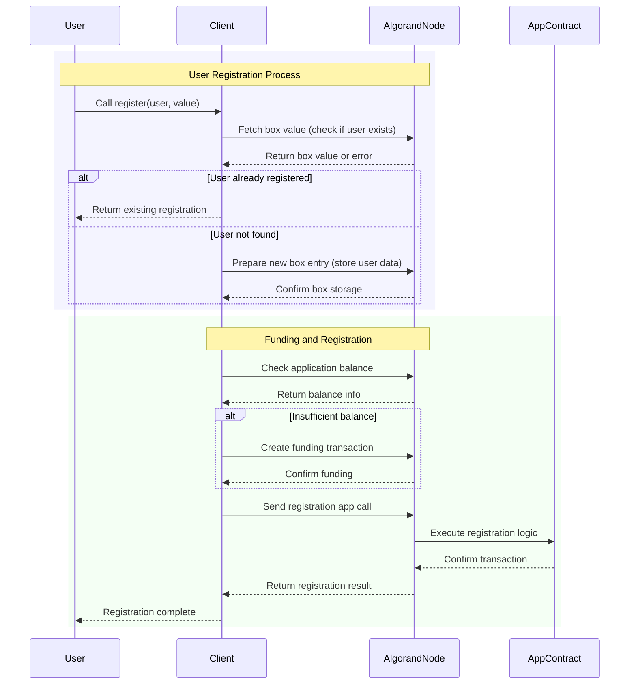
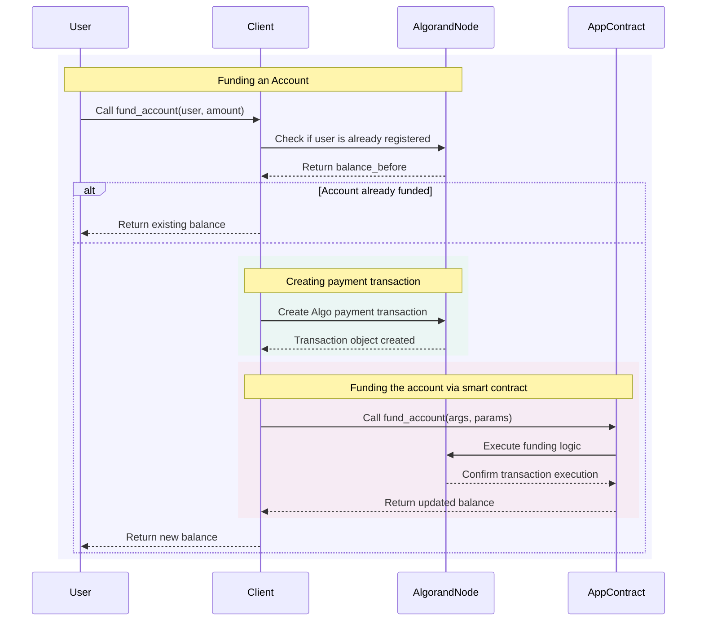
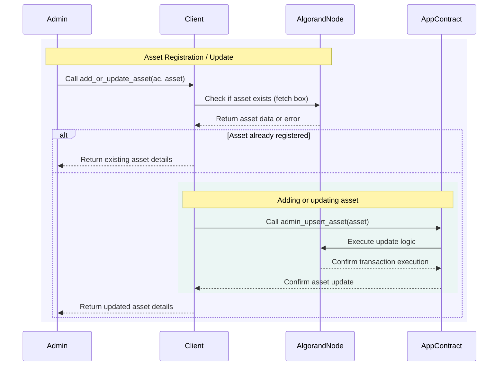
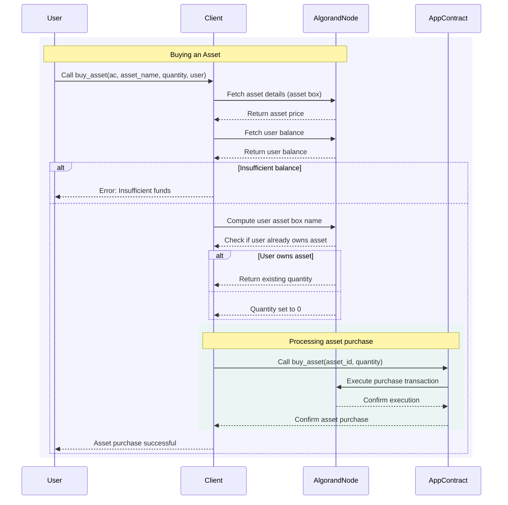

# 🚀 Algorand Smart Contract TP

## 📌 Objective

This TP will guide you through interacting with **Algorand Smart Contract Boxes**.
You will implement missing functionalities to:

- **Register a user**
- **Fund a user account**
- **Add or update assets**
- **Buy assets**

You will fill in the missing parts (`TODO` comments) to complete the transactions.

---

## 🛠 Setup Instructions

### 1️⃣ Prerequisites

Get all file from [https://github.com/SudoWeezy/bloc4/game](https://github.com/SudoWeezy/bloc4/game)

#### open the game repository in you vs code browser

```bash
code game
```

---

## 📝 Tasks

Complete the missing parts marked with **`TODO`**.

### ✅ Task 1: Implement `register()`



- **Find `box_key`**.
- **Calculate `min_balance`** using `get_min_balance_required()`.
- **Add a payment transaction to cover minimum balance**.
- **Send an app call transaction to register the user**.

#### Example Hint:

```python
args = cl.RegisterArgs(name=value)
param = au.CommonAppCallParams(
    box_references=[box_key],
    sender=user.address,
    signer=user.signer
)
composer.add_payment(...)  # Implement this
composer.add_app_call_method_call(ac.params.register(...))  # Implement this
```

---

### ✅ Task 2: Implement `fund_account()`



- **Find correct arguments (`args`) and parameters (`param`)**.
- **Send a funding transaction to increase the user’s balance**.

#### Example Hint:

```python
args = cl.FundAccountArgs(...)  # Implement this
param = au.CommonAppCallParams(...)  # Implement this
balance_returned = ac.send.fund_account(args, param).abi_return
```

---

### ✅ Task 3: Implement `add_or_update_asset()`



- **Store asset data on the blockchain**.
- **Call `ac.send.admin_upsert_asset()` to update the asset**.

#### Example Hint:

```python
ac.send.admin_upsert_asset(
    cl.AdminUpsertAssetArgs(
    ),
    au.CommonAppCallParams(
    )
)
```

---

### ✅ Task 4: Implement `buy_asset()`



- **Ensure the user has enough balance before purchase**.
- **Call `ac.send.buy_asset()` to complete the transaction**.

#### Example Hint:

```python
ac.send.buy_asset(
    cl.BuyAssetArgs(
    ),
    au.CommonAppCallParams(
    )
)
```

---

## ⚠️ Debugging Tips

- Restart **Algorand Sandbox**:

  ```bash
  algokit localnet reset 
  ```

- Open **Lora the Explorer**:`

  ```bash
  algokit explore
  ```

- Print variable values to debug missing data.

---

## 📩 Submission

Once you complete all tasks:
Make sure your script runs without errors.
```bash
  python game.py
```

🎯 **Happy coding!** 🚀
